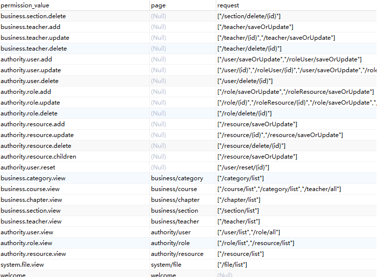

# 权限管理服务

本服务主要作为oauth2的认证中心，但同时自己也是资源服务

## 设计思路

使用RBAC权限模型

用户表 角色表 资源表
用户角色表 角色资源表

表的设计关键在于资源表(resource表)，需要对前端页面和后端接口都进行访问控制

每一行都对应前端的一个页面或者一个按钮

这三个字段比较重要，permission_value权限值(唯一), page能访问的前端路由, request能访问的后端接口,一个界面或按钮要访问的后端接口可能存在多个，所以要使用数组字符串的方式存在数据库里

后端使用json转换的相关方法转成List\<String\>，然后对得到的url进行去重处理 

## 对外提供的接口
提供用户、角色、资源的增删改查、用户角色关联、角色资源关联的接口

根据用户id查询用户拥有的资源

根据用户id查询用户拥有的角色

使用oauth2框架需要添加客户端，所以也提供了注册客户端的接口

获取令牌以及刷新令牌的接口

获取令牌时先要在redis中判断用户是否登录过，登录过就直接从redis里返回令牌

登录完成可以把token存入redis，username为key 申请令牌中的expires_in为过期时间

redis存在宕机可能，而jwt令牌的优势在于无需任何存储就可以验证，为了做到即使redis宕机也不影响令牌获取，redis读写操作时要做好try-catch

## 框架配置类

使用Spring Security Oauth2框架

SecurityConfig是Spring security的基础配置，主要配置还是在OauthServerConfig和ResourceServerConfig

JwtTokenStoreConfig配置使用jwt的token持久化策略，jwt扩展信息里加上用户的id和name

MyUserDetailsServiceImpl是登录时的数据库验证

OauthServerConfig是作为认证服务的配置类

ResourceServerConfig则是作为资源服务的配置类，认证服务的同时也是资源服务，一些接口也需要鉴权，在这个类里配置RbacService，禁用session

RbacService类用来校验当前用户有没有权限访问这个url

OauthExceptionEntryPoint类用来配置认证失败

OauthAccessDeniedHandler类用来配置权限不足

